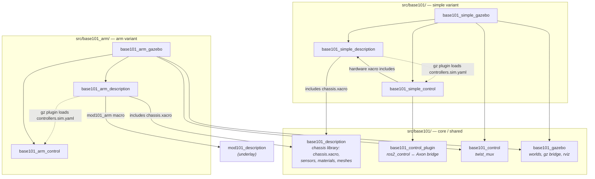

# base101

An open-source 4WD mobile robot platform designed to carry the mod101 arm and other payloads. Built from 60×20 aluminum extrusion, PLA-CF printed parts, and Waveshare DDSM hub motors.

<p align="center">
      
</p>


- 🧱 **Real frame, not a printed box** — 60×20 aluminum extrusion, PLA-CF printed parts only where they earn their place.
- 🕳️ **A deck you can bolt anything to** — 280×400 mm aluminum plate, 3 mm thick, CNC-machined ORP compatible grid. 
- 💥 **TPU corners** — printed bumpers absorb the collisions you're going to have, and spare your furniture while you tune the planner.
- 🛞 **4WD skid steer on hub motors** — four Waveshare DDSM210 direct-drive hubs. No gearboxes, no belts, nothing to slip: the wheel *is* the motor.
- 💪 **Sized for a 5–8 kg robot** — 97 N of tractive force at stall, enough to push 8 kg up a 10% incline. Arm, battery and compute, and it still clears the threshold into the next room.
- 🛰️ **360° lidar** — RPLidar C1 up front, `/scan` at ~10 Hz into SLAM and Nav2. Mapping and autonomous nav work out of the box.
- 👁️ **Swappable depth camera** — RealSense D435 or Luxonis OAK-D on the same bracket, one launch arg apart. Same topics, same frames.
- 🧠 **One board runs the base** — built around the [link101](https://github.com/robocore-dev/link101-hw)
- 🤖 **Carries the [mod101](https://github.com/robocore-dev/mod101) arm** — one xacro line, plus MoveIt config for the *composed* robot: the arm knows the chassis it stands on.


**Here to build the robot?** The hardware is described below. **Here to run the
code?** Skip to [Software](#software) — or straight to [Build](#build).

---

## Software


| If you want to… | Go to |
|---|---|
| understand the package layout | [Packages](#packages) |
| compile the workspace | [Build](#build) |
| launch a sim | [Run it](#run-it) |
| use the arm | [The mod101 arm](#the-mod101-arm) |
| drive it from a browser | [Teleop](#teleop) |
| run it on real hardware | [`HARDWARE.md`](HARDWARE.md) |
| find anything else | [Documentation](#documentation) |

### Packages

The workspace is a **shared core** plus one self-contained stack per
**variant** (`description` / `gazebo` / `control`). Variants are grouped into
folders under `src/` (`base101/`, `base101_arm/`); colcon discovers packages
recursively, so the folders are purely organisational. Packages parked out of
the build live in [`attic/`](attic/README.md).

#### **Core / shared** — `src/base101/`

| Package | Type | Purpose |
|---|---|---|
| `base101_description` | ament_python | **Shared chassis library**: chassis links/joints, sensors, materials, meshes. Every variant `xacro:include`s its `chassis.xacro` — *not launched directly*. |
| `base101_control` | ament_cmake | Control-common: `twist_mux` config. |
| `base101_control_plugin` | ament_cmake | `ros2_control` SystemInterface bridging wheel/arm/camera command+state interfaces to the Axon firmware's `/motor_manager/*` topics (zenoh). Shared by all variants. |
| `base101_gazebo` | ament_cmake | Sim-common: Gazebo worlds, ros↔gz bridge, RViz preset. |

#### **Variant stacks** 
Each is a self-contained `description` + `gazebo` + `control` trio that includes the shared chassis and adds only its own hardware. You launch a variant package — never `base101_description`.

| Variant | Folder | Adds to the chassis | Packages |
|---|---|---|---|
| **simple** | `src/base101/` | nothing (the bare base robot) | `base101_simple_{description,gazebo,control}` |
| **arm** | `src/base101_arm/` | 1 mod101 arm on the chassis deck | `base101_arm_{description,gazebo,control,moveit_config}` |


**Other tooling** — `src/`

| Package | Type | Purpose |
|---|---|---|
| `robocore_agent` | ament_python | Robocore (blueprint engine) agent: ROS interface, task/safety model, Nav2 + SLAM managers, sensor streams. |
| `base101_mcp` | ament_python | Generic ROS2 ↔ MCP (Model Context Protocol) bridge. Lets Claude (or any MCP client) discover topics/services and read/publish messages over natural language. Requires `pip install "fastmcp>=2,<3"`. |
| `base101_teleop` | ament_python | Standalone single-page web teleop (base + every joint) on `:8700`. Fallback for the rosboard Joint sliders card. |
| `rosboard` | ament_python | Vendored web dashboard. Carries two publisher cards: **Teleop** (Twist) and **Joint sliders** (Float64MultiArray position commands for tower + arms). |

### Package structure



Solid arrows are build/`xacro:include` dependencies; dashed arrows are the
runtime `gz_ros2_control` controller-file lookup (resolved at Gazebo spawn,
carried as a manifest dep by the `*_gazebo` package to avoid a cycle).

Manual test procedures for every variant, tool and launch combination are in
[`docs/testing.md`](docs/testing.md).

### Build

**This is the only place build is documented.** Everything else assumes you have
run it.

Bare chassis — no arm, no underlay:

```bash
cd ~/robots/base101
colcon build --symlink-install --cmake-args -DPython3_EXECUTABLE=/usr/bin/python3
source install/setup.bash
```

With the arm (`arm:=true`, and anything under
[The mod101 arm](#the-mod101-arm)), mod101 must be built and sourced first as an
underlay:

```bash
cd ~/robots/mod101 && colcon build --symlink-install && source install/setup.bash
cd ~/robots/base101
colcon build --symlink-install --cmake-args -DPython3_EXECUTABLE=/usr/bin/python3
source install/setup.bash
```

Two footnotes that will save you an afternoon:

- **The `Python3_EXECUTABLE` pin is not arm-specific** — it applies to every
  build in this workspace. It guards against a stray non-system python on `PATH`
  breaking ament's `package.xml` parsing and `rosidl`'s `em` import. To stop
  passing it by hand, set it once in `~/.colcon/defaults.yaml` — see
  [`HARDWARE.md`](HARDWARE.md).
- **`rosdep` doesn't know `mod101_description`.** It is an `exec_depend` of
  `base101_arm_description` but not a rosdep key, so pass
  `--skip-keys mod101_description` if you run `rosdep install`.

### Run it

```bash
ros2 launch base101_simple_gazebo gazebo.launch.py                    # bare chassis, sticky_floor world
ros2 launch base101_arm_gazebo    gazebo.launch.py arm:=true          # chassis + 1 mod101 arm
ros2 launch base101_simple_gazebo gazebo.launch.py world:=empty.sdf   # pick a world
ros2 launch base101_simple_gazebo gazebo.launch.py camera:=oak_d      # Luxonis OAK-D instead of the D435
ros2 launch base101_simple_description display.launch.py              # rviz only, no sim
```

Web teleop is at `http://localhost:8888/` (rosboard) once the sim is up.

`camera:=realsense|oak_d` picks which depth module hangs off the front bracket
(default `realsense`). It swaps the mesh and the simulated FOV only — the
topics stay `/base_camera/*` and the frames stay `camera_link` /
`camera_optical_frame` either way. Both `gazebo.launch.py` and
`display.launch.py` take it.

For the **real robot** (Axon 2 firmware over zenoh), see [`HARDWARE.md`](HARDWARE.md):

```bash
export RMW_IMPLEMENTATION=rmw_zenoh_cpp
ros2 launch base101_simple_control control_stack.launch.py
```

## The mod101 arm

The [mod101](https://github.com/robocore-dev/mod101) repo stays standalone —
its arm is a prefix-parameterised xacro macro (`mod101_arm`, see
`mod101_description/urdf/mod101_macro.xacro`). The **arm** variant
(`base101_arm_description`) instantiates it once, deck-mounted, producing
joints `arm_1…6`. (The parked tower instantiated it twice on the crossbeam
brackets, as `left_arm_1…6` / `right_arm_1…6`.)

#### The overlay: exactly three crossing points

mod101 is an **underlay** — built and sourced first, it puts its packages on
`AMENT_PREFIX_PATH`. base101 is the overlay. **Nothing in mod101 knows base101
exists**, and base101 reaches back across the boundary in only three places:

| Crossing | Where, in base101 | What it pulls from mod101 |
|---|---|---|
| **Geometry** | `base101_arm_description/urdf/arm.xacro` | `<xacro:mod101_arm prefix="arm_" parent="top_plate_1">` from `mod101_macro.xacro` |
| **Semantics** | `base101_arm_moveit_config/srdf/base101_arm.srdf.xacro` | `<xacro:mod101_arm_srdf prefix="arm_" tool=…>` from `mod101_moveit_config` |
| **Build args** | both files above | `mod101_config.xacro` — rail lengths, servo mounts, active tool |

Two macro calls and one config file. No forked packages, no vendored meshes, no
duplicated URDF. That is what lets the parked tower mount the *same* macro twice
(`left_arm_` / `right_arm_`) with zero changes upstream.

Two consequences worth internalising:

- **Only the `arm` variant crosses.** The `simple` variant never touches the
  underlay, so a bare-chassis build needs no mod101 at all.
- **The prefix renames everything the macro emits.** `joint_base` becomes
  `arm_joint_base`; planning group `arm` becomes **`arm_arm`**. Every base101
  config keys on the prefixed names. It reads badly and it is correct.

**Build:** the arm needs the mod101 underlay built and sourced first — see
[Build](#build). Everything below assumes that.

**Launch:**

```bash
ros2 launch base101_arm_gazebo gazebo.launch.py arm:=true                   # jaws gripper
ros2 launch base101_arm_gazebo gazebo.launch.py arm:=true arm_tool:=parallel
ros2 launch base101_arm_description display.launch.py arm:=true            # rviz only
```

`arm_tool` defaults to whatever the mod101 configurator last saved, as do the
rail lengths and servo mounts — `mod101_config.xacro` is the single source of
truth and base101 reads it, so reconfiguring the arm and rebuilding is enough.

**Motion planning** (`base101_arm_moveit_config`):

```bash
ros2 launch base101_arm_moveit_config demo.launch.py     # gazebo + move_group
```

This exists because mod101's own MoveIt config only knows arm-vs-arm
collisions; the arm can reach every part of the chassis it sits on, so the
composed robot needs its own self-collision matrix. The planning scene knows
the robot but not the world — see
[`docs/obstacle-awareness.md`](docs/obstacle-awareness.md) for where perceived
obstacles should live relative to a picking layer. Note the sim must run with
`arm_control:=moveit` (the demo launch does this) to spawn the
`FollowJointTrajectory` controllers instead of the `Float64MultiArray` ones the
web sliders use — see
[`base101_arm_moveit_config/README.md`](src/base101_arm/base101_arm_moveit_config/README.md).

**Controllers** (arm/gripper are `position_controllers/JointGroupPositionController`,
commands are `std_msgs/Float64MultiArray` on `/<name>/commands`):

| Controller | Joints |
|---|---|
| `arm_controller` | `arm_joint_base, arm_joint_shoulder, arm_joint_elbow, arm_joint_wrist_tilt, arm_joint_wrist_roll` |
| `gripper_controller` | `arm_6` (the tool joint) |
| `diff_drive_controller` | wheels (via `twist_mux`) |

The wrist camera is bridged as `/arm_wrist_camera/image_raw`. Integration
notes (mount-point measurement, the arm-yaw fix, the
stale-`robot_state_publisher` gotcha):
[`docs/worklogs/dual_arm.md`](docs/worklogs/dual_arm.md).

## Teleop

Two ways to drive everything from a browser:

- **rosboard "Joint sliders" card** (recommended): open rosboard
  (`http://localhost:8888/`), pick **Joint sliders** in the System nav. One
  panel with a position slider for every controlled joint — lift, pan/tilt
  head, both arms, both grippers — initialised from the live robot pose,
  with live position readouts and a re-sync button. Groups whose hardware
  isn't loaded hide automatically; the card persists across reloads. Base
  driving stays on the separate **Teleop** card. (Backed by rosboard's
  `MSG_PUB` channel; `std_msgs/Float64MultiArray` is allowlisted and —
  unlike Twist — deliberately *not* zeroed by the publish watchdog, so
  position commands hold when the browser goes quiet.)
- **`base101_teleop`** — a zero-dependency standalone fallback:
  `ros2 run base101_teleop server` → `http://localhost:8700/`. Same sliders
  plus a hold-to-drive base pad. See
  [`src/base101_teleop/README.md`](src/base101_teleop/README.md).

## Simulation

The robot runs in **Gazebo Sim** via `gz_ros2_control`. A `simulator` xacro
arg on each variant (`gazebo` | `none`) selects whether the URDF carries the
sim ros2_control + extension tags; `none` is the bare URDF for rviz / real
hardware. Launch a variant's `*_gazebo` package (see Quickstart). The sim
publishes the standard `/cmd_vel_*`, `/odom`, `/scan`, `/joint_states`, and
`/base_camera/image_raw` topics. Worlds and the gz↔ros bridge config live in
the shared `base101_gazebo` package.


## Documentation

**Use it**

- **[`HARDWARE.md`](HARDWARE.md)** — real-robot bringup: Axon 2 firmware, the zenoh router, serial devices, udev
- **[`docs/testing.md`](docs/testing.md)** — manual test procedures for every variant, tool and launch combination

**Build on it**

- **[`src/base101_arm/base101_arm_moveit_config/README.md`](src/base101_arm/base101_arm_moveit_config/README.md)** — motion planning for the composed robot, and the sync step after the arm is reconfigured
- **[`src/base101/base101_description/README.md`](src/base101/base101_description/README.md)** — the shared chassis library
- **[`docs/robocore-camera-frames.md`](docs/robocore-camera-frames.md)** — camera frame conventions, and the `optical: true` change robocore-sdk still needs
- **[`docs/obstacle-awareness.md`](docs/obstacle-awareness.md)** — where perceived obstacles should live relative to a picking layer

**History** — kept for reasoning, not as current documentation

- **[`docs/worklogs/dual_arm.md`](docs/worklogs/dual_arm.md)** — dual-arm integration: mount-point measurement, the arm-yaw fix, the stale-`robot_state_publisher` gotcha
- **[`docs/worklogs/tower.md`](docs/worklogs/tower.md)** — the parked cross tower
- **[`docs/worklogs/nav.md`](docs/worklogs/nav.md)**, **[`docs/worklogs/nav_restructure.md`](docs/worklogs/nav_restructure.md)** — Nav2 + slam_toolbox porting notes. **These describe `src/base101_nav/` and a `base101.repos` file, neither of which is in this workspace** — read them as history, not instructions.

## Related Projects

- **[mod101](https://github.com/robocore-dev/mod101)** — 5+1 DOF modular robot arm
- **[Axon](https://github.com/robocore-dev/axon)** — Multi-protocol controller board
- **[Forge](https://github.com/robocore-dev/forge)** — ROS2 deployment orchestration

## License
MIT
