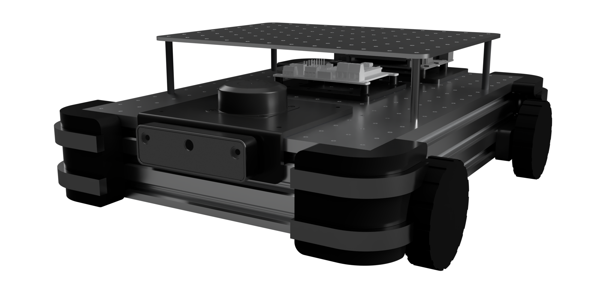
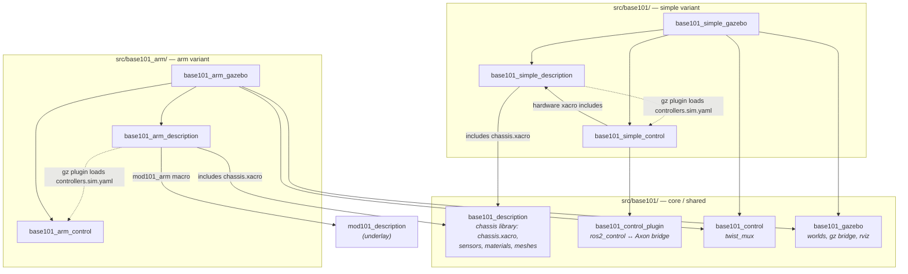

# base101

<p align="center">
      
</p>

**An open-source mobile base you can actually build things on.**

Every robot project that has to *move* starts the same way: you want to work on
the interesting part — the arm, the perception, the behaviour — and instead you
spend six weeks building a cart. Then you want to add a lidar, and there's
nowhere to put it. Then you add a compute board, and you're drilling into your
own chassis. Most open mobile bases are somebody's finished robot, published as
if it were a platform, and the moment your payload differs from theirs you're
forking it.

base101 is the other thing: a chassis whose entire job is to carry whatever you
bolt to it. A machined deck with a grid of tapped holes, four direct-drive hub
motors, a lidar and a depth camera already wired into ROS 2, and a one-line
mounting point for the [mod101](https://github.com/robocore-dev/mod101) arm. It
drives, maps and navigates on day one, so the part you actually care about can
start on day two.

- 🧱 **Real frame, not a printed box** — 60×20 aluminum extrusion, PLA-CF printed parts only where they earn their place.
- 🕳️ **A deck you can bolt anything to** — 280×400 mm aluminum plate, 3 mm thick, CNC-machined ORP compatible grid. 
- 💥 **TPU corners** — printed bumpers absorb the collisions you're going to have, and spare your furniture while you tune the planner.
- 🛞 **4WD skid steer on hub motors** — four Waveshare DDSM210 direct-drive hubs. No gearboxes, no belts, nothing to slip: the wheel *is* the motor.
- 💪 **Sized for a 5–8 kg robot** — 97 N of tractive force at stall, enough to push 8 kg up a 10% incline. Arm, battery and compute, and it still clears the threshold into the next room.
- 🛰️ **360° lidar** — RPLidar C1 up front, `/scan` at ~10 Hz into SLAM and Nav2. Mapping and autonomous nav work out of the box.
- 👁️ **Swappable depth camera** — RealSense D435 or Luxonis OAK-D on the same bracket, one launch arg apart. Same topics, same frames.
- 🧠 **One board runs the base** — built around the [link101](https://github.com/robocore-dev/link101-hw)
- 🤖 **Carries the [mod101](https://github.com/robocore-dev/mod101) arm** — one xacro line, plus MoveIt config for the *composed* robot: the arm knows the chassis it stands on.

**Here to build the robot?** The hardware is described below. **Here to run the
code?** Start with [Getting started](#getting-started).

---

## Getting started

You'll need ROS 2 Jazzy on Ubuntu 24.04. Everything else (Gazebo Harmonic,
`ros2_control`, `gz_ros2_control`) comes from apt.

**Just the chassis** — no arm, nothing else to build first:

```bash
cd ~/robots/base101
colcon build --symlink-install --cmake-args -DPython3_EXECUTABLE=/usr/bin/python3
source install/setup.bash

ros2 launch base101_simple_gazebo gazebo.launch.py
```

That's a robot in Gazebo, driving, scanning, publishing `/odom` — open
`http://localhost:8888/` and drive it around from the browser.

**With the arm**, mod101 has to be built and sourced first (it's the underlay;
base101 sits on top of it):

```bash
cd ~/robots/mod101 && colcon build --symlink-install && source install/setup.bash
cd ~/robots/base101
colcon build --symlink-install --cmake-args -DPython3_EXECUTABLE=/usr/bin/python3
source install/setup.bash

ros2 launch base101_arm_gazebo gazebo.launch.py arm:=true
```

**This is the only place the build is documented** — everything below assumes
you've run it. Two footnotes that will save you an afternoon:

- **The `Python3_EXECUTABLE` pin isn't arm-specific.** It applies to every build
  here, and it guards against a stray non-system python on `PATH` breaking
  ament's `package.xml` parsing and `rosidl`'s `em` import. Tired of typing it?
  Set it once in `~/.colcon/defaults.yaml` — see [`HARDWARE.md`](HARDWARE.md).
- **`rosdep` has never heard of `mod101_description`.** It's an `exec_depend` of
  `base101_arm_description` but not a rosdep key, so pass
  `--skip-keys mod101_description` if you run `rosdep install`.

### Things to try

```bash
ros2 launch base101_simple_gazebo gazebo.launch.py                    # bare chassis, sticky_floor world
ros2 launch base101_arm_gazebo    gazebo.launch.py arm:=true          # chassis + 1 mod101 arm
ros2 launch base101_simple_gazebo gazebo.launch.py world:=empty.sdf   # pick a world
ros2 launch base101_simple_gazebo gazebo.launch.py camera:=oak_d      # Luxonis OAK-D instead of the D435
ros2 launch base101_simple_description display.launch.py              # rviz only, no sim
```

`camera:=realsense|oak_d` picks which depth module hangs off the front bracket
(default `realsense`). It only swaps the mesh and the simulated FOV — topics
stay `/base_camera/*` and frames stay `camera_link` / `camera_optical_frame`
either way, so nothing downstream notices. Both `gazebo.launch.py` and
`display.launch.py` take it.

Manual test procedures for every variant, tool and launch combination are in
[`docs/testing.md`](docs/testing.md).

### On the real robot

Motors, IMU and lidar all hang off the Axon 2 board and talk to ROS 2 over
zenoh, so bringup is two lines:

```bash
export RMW_IMPLEMENTATION=rmw_zenoh_cpp
ros2 launch base101_simple_control control_stack.launch.py
```

Firmware, the zenoh router, serial devices and udev rules:
[`HARDWARE.md`](HARDWARE.md).

## Adding the mod101 arm

**The whole point of the deck is that something goes on it.** The obvious
something is [mod101](https://github.com/robocore-dev/mod101), a 5+1 DOF arm
that's designed to be embedded — it's a prefix-parameterised xacro macro, so
base101 mounts it with one call and gets joints `arm_1…6`.

```bash
ros2 launch base101_arm_gazebo gazebo.launch.py arm:=true                   # jaws gripper
ros2 launch base101_arm_gazebo gazebo.launch.py arm:=true arm_tool:=parallel
ros2 launch base101_arm_description display.launch.py arm:=true             # rviz only
```

You don't configure the arm here. Rail lengths, servo mounts and the active
tool all come from `mod101_config.xacro` — whatever mod101's web configurator
last saved. Resize the arm over there, rebuild here, done.

### How the two repos meet

mod101 is an **underlay**: built and sourced first, it puts its packages on
`AMENT_PREFIX_PATH`, and base101 is the overlay on top. **Nothing in mod101
knows base101 exists.** base101 reaches back across the boundary in exactly
three places:

| Crossing | Where, in base101 | What it pulls from mod101 |
|---|---|---|
| **Geometry** | `base101_arm_description/urdf/arm.xacro` | `<xacro:mod101_arm prefix="arm_" parent="top_plate_1">` from `mod101_macro.xacro` |
| **Semantics** | `base101_arm_moveit_config/srdf/base101_arm.srdf.xacro` | `<xacro:mod101_arm_srdf prefix="arm_" tool=…>` from `mod101_moveit_config` |
| **Build args** | both files above | `mod101_config.xacro` — rail lengths, servo mounts, active tool |

Two macro calls and one config file. No forked packages, no vendored meshes, no
duplicated URDF — which is what let the (now parked) dual-arm tower mount the
*same* macro twice, `left_arm_` / `right_arm_`, with zero changes upstream.

Two things worth knowing before they confuse you:

- **Only the `arm` variant crosses over.** The `simple` variant never touches
  the underlay, so a bare-chassis build needs no mod101 at all.
- **The prefix renames everything the macro emits.** `joint_base` becomes
  `arm_joint_base`, and the planning group `arm` becomes **`arm_arm`**. Every
  base101 config keys on the prefixed names. It reads badly and it is correct.

### Motion planning

```bash
ros2 launch base101_arm_moveit_config demo.launch.py     # gazebo + move_group
```

This config exists because mod101's own only knows arm-vs-arm collisions — but
the arm can reach every part of the chassis it's bolted to, so the composed
robot needs its own self-collision matrix. The planning scene knows the robot,
not the world; [`docs/obstacle-awareness.md`](docs/obstacle-awareness.md)
covers where perceived obstacles should live relative to a picking layer.

One gotcha: the sim has to run with `arm_control:=moveit` (the demo launch does
this for you) so it spawns `FollowJointTrajectory` controllers instead of the
`Float64MultiArray` ones the web sliders use. Details in
[`base101_arm_moveit_config/README.md`](src/base101_arm/base101_arm_moveit_config/README.md).

**Controllers** — arm and gripper are
`position_controllers/JointGroupPositionController`, commanded with
`std_msgs/Float64MultiArray` on `/<name>/commands`:

| Controller | Joints |
|---|---|
| `arm_controller` | `arm_joint_base, arm_joint_shoulder, arm_joint_elbow, arm_joint_wrist_tilt, arm_joint_wrist_roll` |
| `gripper_controller` | `arm_6` (the tool joint) |
| `diff_drive_controller` | wheels (via `twist_mux`) |

The wrist camera is bridged as `/arm_wrist_camera/image_raw`.

## Driving it from a browser

No joystick, no terminal, no extra install — two ways:

- **rosboard's "Joint sliders" card** (the good one): open
  `http://localhost:8888/`, pick **Joint sliders** in the System nav. One panel,
  a position slider for every controlled joint, initialised from the live robot
  pose with readouts and a re-sync button. Groups whose hardware isn't loaded
  hide themselves, and the card survives a reload. Base driving lives on the
  separate **Teleop** card. (Position commands deliberately *aren't* zeroed by
  the publish watchdog the way Twist is, so the arm holds its pose when the
  browser goes quiet.)
- **`base101_teleop`** — a zero-dependency fallback if rosboard is unhappy:
  `ros2 run base101_teleop server` → `http://localhost:8700/`. Same sliders plus
  a hold-to-drive base pad. See
  [`src/base101_teleop/README.md`](src/base101_teleop/README.md).

## Simulation

The robot runs in **Gazebo Sim** through `gz_ros2_control`, and the sim is
meant to be the default place you work — it publishes the same `/cmd_vel_*`,
`/odom`, `/scan`, `/joint_states` and `/base_camera/image_raw` topics the real
robot does, so code written against sim moves over unchanged.

Each variant takes a `simulator` xacro arg (`gazebo` | `none`) that decides
whether the URDF carries the sim `ros2_control` and extension tags; `none` is
the bare URDF for rviz and real hardware. Worlds and the gz↔ros bridge config
live in the shared `base101_gazebo` package.

## How the workspace is put together

*Skip this unless you're adding a package — everything above works without it.*

It's a **shared core** plus one self-contained stack per **variant**
(`description` / `gazebo` / `control`). Variants are grouped into folders under
`src/` (`base101/`, `base101_arm/`); colcon discovers packages recursively, so
the folders are purely organisational. Packages parked out of the build live in
[`attic/`](attic/README.md).

**Core / shared** — `src/base101/`

| Package | Type | Purpose |
|---|---|---|
| `base101_description` | ament_python | **Shared chassis library**: chassis links/joints, sensors, materials, meshes. Every variant `xacro:include`s its `chassis.xacro` — *not launched directly*. |
| `base101_control` | ament_cmake | Control-common: `twist_mux` config. |
| `base101_control_plugin` | ament_cmake | `ros2_control` SystemInterface bridging wheel/arm/camera command+state interfaces to the Axon firmware's `/motor_manager/*` topics (zenoh). Shared by all variants. |
| `base101_gazebo` | ament_cmake | Sim-common: Gazebo worlds, ros↔gz bridge, RViz preset. |

**Variant stacks** — each is a self-contained `description` + `gazebo` +
`control` trio that includes the shared chassis and adds only its own hardware.
You launch a variant package, never `base101_description`.

| Variant | Folder | Adds to the chassis | Packages |
|---|---|---|---|
| **simple** | `src/base101/` | nothing (the bare base robot) | `base101_simple_{description,gazebo,control}` |
| **arm** | `src/base101_arm/` | 1 mod101 arm on the chassis deck | `base101_arm_{description,gazebo,control,moveit_config}` |

**Other tooling** — `src/`

| Package | Type | Purpose |
|---|---|---|
| `robocore_agent` | ament_python | Robocore (blueprint engine) agent: ROS interface, task/safety model, Nav2 + SLAM managers, sensor streams. |
| `base101_mcp` | ament_python | Generic ROS2 ↔ MCP (Model Context Protocol) bridge. Lets Claude (or any MCP client) discover topics/services and read/publish messages over natural language. Requires `pip install "fastmcp>=2,<3"`. |
| `base101_teleop` | ament_python | Standalone single-page web teleop (base + every joint) on `:8700`. Fallback for the rosboard Joint sliders card. |
| `rosboard` | ament_python | Vendored web dashboard. Carries two publisher cards: **Teleop** (Twist) and **Joint sliders** (Float64MultiArray position commands for tower + arms). |



Solid arrows are build/`xacro:include` dependencies; dashed arrows are the
runtime `gz_ros2_control` controller-file lookup (resolved at Gazebo spawn,
carried as a manifest dep by the `*_gazebo` package to avoid a cycle).

## Deeper docs

**Use it**

- **[`HARDWARE.md`](HARDWARE.md)** — real-robot bringup: Axon 2 firmware, the zenoh router, serial devices, udev
- **[`docs/testing.md`](docs/testing.md)** — manual test procedures for every variant, tool and launch combination

**Build on it**

- **[`src/base101_arm/base101_arm_moveit_config/README.md`](src/base101_arm/base101_arm_moveit_config/README.md)** — motion planning for the composed robot, and the sync step after the arm is reconfigured
- **[`src/base101/base101_description/README.md`](src/base101/base101_description/README.md)** — the shared chassis library
- **[`docs/robocore-camera-frames.md`](docs/robocore-camera-frames.md)** — camera frame conventions, and the `optical: true` change robocore-sdk still needs
- **[`docs/obstacle-awareness.md`](docs/obstacle-awareness.md)** — where perceived obstacles should live relative to a picking layer

**History** — kept for reasoning, not as current documentation

- **[`docs/worklogs/dual_arm.md`](docs/worklogs/dual_arm.md)** — dual-arm integration: mount-point measurement, the arm-yaw fix, the stale-`robot_state_publisher` gotcha
- **[`docs/worklogs/tower.md`](docs/worklogs/tower.md)** — the parked cross tower
- **[`docs/worklogs/nav.md`](docs/worklogs/nav.md)**, **[`docs/worklogs/nav_restructure.md`](docs/worklogs/nav_restructure.md)** — Nav2 + slam_toolbox porting notes. **These describe `src/base101_nav/` and a `base101.repos` file, neither of which is in this workspace** — read them as history, not instructions.

## Related Projects

- **[mod101](https://github.com/robocore-dev/mod101)** — 5+1 DOF modular robot arm
- **[Axon](https://github.com/robocore-dev/axon)** — Multi-protocol controller board
- **[Forge](https://github.com/robocore-dev/forge)** — ROS2 deployment orchestration

## License
MIT
