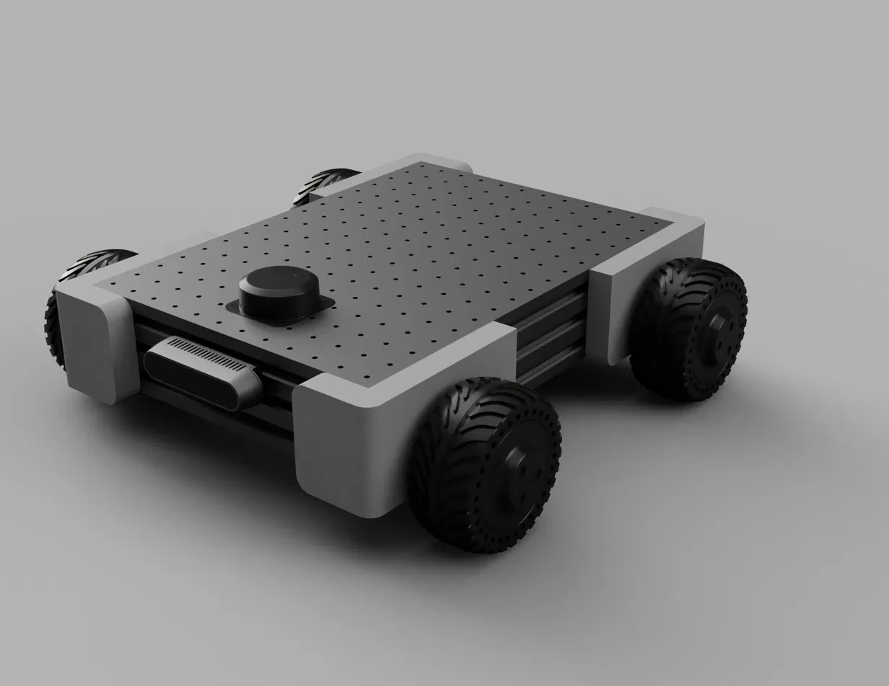

# base101

<p align="center">
  
  
</p>

An open-source 4WD mobile robot platform designed to carry the mod101 arm and other payloads. Built from 60×20 aluminum extrusion, PLA-CF printed parts, and Waveshare DDSM hub motors.

Two configurations, same chassis, different motors.

## At a Glance

| | base101 | base101 PRO |
|---|---|---|
| Motors | 4× DDSM210 | 4× DDSM115 |
| Drive | 4WD skid steer | 4WD skid steer |
| Torque (per motor) | 0.85 N·m stall | 2.0 N·m stall |
| Load capacity | ~12kg total | ~30kg total |
| Suspension | PLA-CF printed | PLA-CF printed |
| Footprint | 280 × 400mm | 280 × 400mm |
| Lidar | RPLidar C1 | RPLidar C1 |
| Depth camera | RealSense D435 | RealSense D435 |
| BOM | ~$340 | ~$480 |

Both configurations share the same chassis, top plate, bumpers, electronics, and software. The upgrade from base to PRO is a motor and bracket swap.


## Chassis

**Frame:** 60×20 aluminum extrusion, black anodized. Two parallel rails connected at the corners by PLA-CF printed mounts. The thin profile keeps the center of gravity low — this is a MacBook Air, not a brick.

**Top plate:** 280×400mm aluminum, 3mm thick, CNC-machined grid of M3 tapped holes on 20mm spacing. Mount anything anywhere — the arm, the lidar, the compute, accessories. No adapters, no T-nuts, just bolt it down.

**Bumpers:** TPU printed corner pieces. Absorb collisions, protect furniture, and visually soften the rectangular chassis. Press-fit onto the extrusion corners, no fasteners needed.


## Drivetrain

**4WD skid steer.** Four hub motors, all driven. Turn-in-place capability. No mecanum wheels, no omni wheels — just rubber tires on smooth direct-drive motors. Quiet, clean, simple kinematics.


### DDSM210 (base101)

- 0.25 N·m rated / 0.85 N·m stall
- ~65mm diameter, 216g
- UART bus, 9-28V
- ~$25 each

Sized for a 5-8kg robot. Four wheels provide 97 N total tractive force at stall — enough to move 8kg up a 10% incline.

### DDSM115 (base101 PRO)

- 0.96 N·m rated / 2.0 N·m stall
- ~115mm diameter, 765g
- RS485 bus, 12-24V
- ~$60 each


## Sensors

### RPLidar C1

Mounted on the top plate. 360° DTOF scanning, 12m range, 5000 samples/sec. Handles SLAM, mapping, and obstacle detection. ROS2 driver available out of the box.

### Intel RealSense D435

Front-mounted between the extrusion rails. 87° wide FOV for spatial awareness and 3D perception. Provides point cloud data for obstacle avoidance and workspace mapping. The wide field of view captures the arm's entire workspace in front of the robot.


## Software

ROS 2 Jazzy workspace. The `diff_drive_controller` handles skid-steer kinematics for both DDSM210 and DDSM115 configurations — the only parameter change is wheel diameter and separation.

### Packages

| Package | Type | Purpose |
|---|---|---|
| `base101_description` | ament_python | Unified URDF (simple/pro selectable via xacro arg), meshes, RViz config. |
| `base101_control` | ament_cmake | `diff_drive_controller` + `twist_mux` config, hardware bringup launch. |
| `base101_gazebo` | ament_cmake | Gazebo Sim worlds, launch, ros↔gz bridge. |
| `base101_teleop_web` | ament_python | Browser-based virtual joystick → `/cmd_vel_joy`. |
| `rosboard` | ament_python | Vendored web dashboard (publishes a Teleop card too). |

### Quickstart

```bash
colcon build --symlink-install
source install/setup.bash
ros2 launch base101_gazebo gazebo.launch.py        # simple variant, sticky_floor world
ros2 launch base101_gazebo gazebo.launch.py variant:=pro world:=empty.sdf
```

Web teleop is at `http://localhost:8888/` (rosboard) once the sim is up.


## Project Status

- [x] Chassis design (Fusion 360)
- [x] Render and proportioning
- [x] Motor selection and analysis
- [x] Suspension design (PLA-CF adaptation)
- [x] URDF/xacro
- [x] Gazebo simulation
- [x] ros2_control integration
- [ ] Nav2 configuration
- [ ] E-stop handle mechanism
- [ ] CNC top plate manufacturing files (DXF)
- [ ] Combined base101 + mod101 system launch

## Related Projects

- **[mod101](https://github.com/robocore-dev/mod101)** — 5+1 DOF modular robot arm
- **[Axon](https://github.com/robocore-dev/axon)** — Multi-protocol controller board
- **[Forge](https://github.com/robocore-dev/forge)** — ROS2 deployment orchestration

## License

MIT
