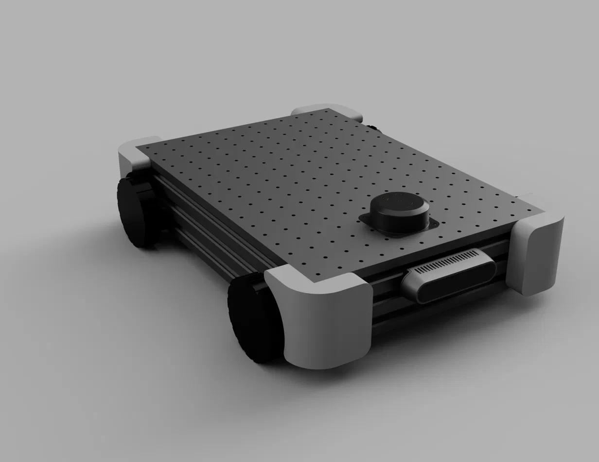
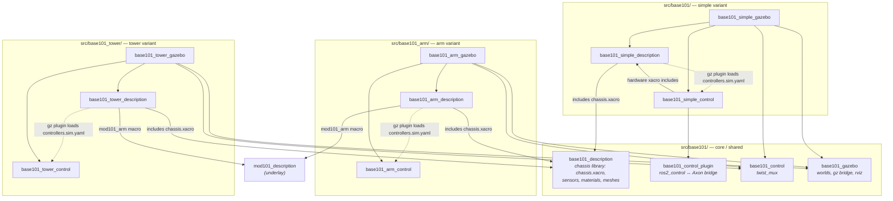

# base101

<p align="center">
  
</p>

An open-source 4WD mobile robot platform designed to carry the mod101 arm and other payloads. Built from 60×20 aluminum extrusion, PLA-CF printed parts, and Waveshare DDSM hub motors.

## At a Glance

| | base101 |
|---|---|
| Motors | 4× DDSM210 |
| Drive | 4WD skid steer |
| Torque (per motor) | 0.85 N·m stall |
| Load capacity | ~12kg total |
| Suspension | PLA-CF printed |
| Footprint | 280 × 400mm |
| Lidar | RPLidar C1 |
| Depth camera | RealSense D435 |
| BOM | ~$340 |


## Chassis

**Frame:** 60×20 aluminum extrusion, black anodized. Two parallel rails connected at the corners by PLA-CF printed mounts. The thin profile keeps the center of gravity low — this is a MacBook Air, not a brick.

**Top plate:** 280×400mm aluminum, 3mm thick, CNC-machined grid of M3 tapped holes on 20mm spacing. Mount anything anywhere — the arm, the lidar, the compute, accessories. No adapters, no T-nuts, just bolt it down.

**Bumpers:** TPU printed corner pieces. Absorb collisions, protect furniture, and visually soften the rectangular chassis. Press-fit onto the extrusion corners, no fasteners needed.


## Drivetrain

**4WD skid steer.** Four hub motors, all driven. Turn-in-place capability. No mecanum wheels, no omni wheels — just rubber tires on smooth direct-drive motors. Quiet, clean, simple kinematics.


### DDSM210

- 0.25 N·m rated / 0.85 N·m stall
- ~65mm diameter, 216g
- UART bus, 9-28V
- ~$25 each

Sized for a 5-8kg robot. Four wheels provide 97 N total tractive force at stall — enough to move 8kg up a 10% incline.


## Sensors

### RPLidar C1

Mounted on the top plate. 360° DTOF scanning, 12m range, 5000 samples/sec. Handles SLAM, mapping, and obstacle detection. ROS2 driver available out of the box.

### Intel RealSense D435

Front-mounted between the extrusion rails. 87° wide FOV for spatial awareness and 3D perception. Provides point cloud data for obstacle avoidance and workspace mapping. The wide field of view captures the arm's entire workspace in front of the robot.


## Software

ROS 2 Jazzy workspace. The `diff_drive_controller` handles skid-steer kinematics for the DDSM210 drivetrain.

### Packages

The workspace is a **shared core** plus one self-contained stack per
**variant** (`description` / `gazebo` / `control`). Variants are grouped into
folders under `src/` (`base101/`, `base101_arm/`, `base101_tower/`); colcon
discovers packages recursively, so the folders are purely organisational.

**Core / shared** — `src/base101/`

| Package | Type | Purpose |
|---|---|---|
| `base101_description` | ament_python | **Shared chassis library**: chassis links/joints, sensors, materials, meshes. Every variant `xacro:include`s its `chassis.xacro` — *not launched directly*. |
| `base101_control` | ament_cmake | Control-common: `twist_mux` config. |
| `base101_control_plugin` | ament_cmake | `ros2_control` SystemInterface bridging wheel/arm/camera command+state interfaces to the Axon firmware's `/motor_manager/*` topics (zenoh). Shared by all variants. |
| `base101_gazebo` | ament_cmake | Sim-common: Gazebo worlds, ros↔gz bridge, RViz preset. |

**Variant stacks** — each is a self-contained `description` + `gazebo` + `control` trio that includes the shared chassis and adds only its own hardware. You launch a variant package — never `base101_description`.

| Variant | Folder | Adds to the chassis | Packages |
|---|---|---|---|
| **simple** | `src/base101/` | nothing (the bare base robot) | `base101_simple_{description,gazebo,control}` |
| **arm** | `src/base101_arm/` | hex standoff deck + 1 deck-mounted mod101 arm | `base101_arm_{description,gazebo,control}` |
| **tower** | `src/base101_tower/` | lift column + pan/tilt head + optional 2 bracket arms | `base101_tower_{description,gazebo,control}` |

The simple variant's `*_control` also carries the real-hardware bringup (`control_stack.launch.py`, the Axon hardware xacro) — see [`HARDWARE.md`](HARDWARE.md).

**Other tooling** — `src/`

| Package | Type | Purpose |
|---|---|---|
| `robocore_agent` | ament_python | Robocore (blueprint engine) agent: ROS interface, task/safety model, Nav2 + SLAM managers, sensor streams. |
| `base101_mcp` | ament_python | Generic ROS2 ↔ MCP (Model Context Protocol) bridge. Lets Claude (or any MCP client) discover topics/services and read/publish messages over natural language. Requires `pip install "fastmcp>=2,<3"`. |
| `base101_teleop` | ament_python | Standalone single-page web teleop (base + every joint) on `:8700`. Fallback for the rosboard Joint sliders card. |
| `rosboard` | ament_python | Vendored web dashboard. Carries two publisher cards: **Teleop** (Twist) and **Joint sliders** (Float64MultiArray position commands for tower + arms). |

### Package structure



Solid arrows are build/`xacro:include` dependencies; dashed arrows are the
runtime `gz_ros2_control` controller-file lookup (resolved at Gazebo spawn,
carried as a manifest dep by the `*_gazebo` package to avoid a cycle).

### Quickstart

```bash
colcon build --symlink-install
source install/setup.bash
ros2 launch base101_simple_gazebo gazebo.launch.py                    # bare chassis, sticky_floor world
ros2 launch base101_arm_gazebo    gazebo.launch.py arm:=true          # chassis + 1 mod101 arm
ros2 launch base101_tower_gazebo  gazebo.launch.py arms:=true         # chassis + tower + 2 arms
ros2 launch base101_simple_gazebo gazebo.launch.py world:=empty.sdf   # pick a world
```

Web teleop is at `http://localhost:8888/` (rosboard) once the sim is up.
(The arm/tower variants need the [mod101](https://github.com/robocore-dev/mod101)
underlay built and sourced first.)

For the **real robot** (Axon 2 firmware over zenoh), see [`HARDWARE.md`](HARDWARE.md):

```bash
export RMW_IMPLEMENTATION=rmw_zenoh_cpp
ros2 launch base101_simple_control control_stack.launch.py
```

### Cross tower (optional)

An optional vertical tower (merged from the former `base101_cross_description`
CAD export) bolts onto the top plate: a column with a prismatic **lift**
carrying a crossbeam with two arm-mount brackets, and a **pan/tilt head**
with a camera on top. It's the **tower** variant — `base101_tower_description`
includes the shared chassis and overlays the tower (sim-only for now):

```bash
ros2 launch base101_tower_gazebo  gazebo.launch.py    # tower, no arms
ros2 launch base101_tower_description display.launch.py   # rviz only
```

| Joint | Type | Range | Notes |
|---|---|---|---|
| `lift` | prismatic | ±0.26 m | Axis points **down**: `+0.26` = bottom of stroke, `-0.26` = top, `0` = mid-travel. Effort limit 400 N — sized for the fully loaded carriage (crossbeam + brackets + two arms). |
| `head_pan` | continuous | — | `+` = CCW/left (REP-103 yaw). Axis re-anchored on the pan motor shaft (the CAD export had it ~15 cm off). |
| `head_tilt` | continuous | — | `+y` axis. |

All three are position-controlled by **`tower_controller`**
(`position_controllers/JointGroupPositionController`, spawned automatically
by the `base101_tower_gazebo` launch):

```bash
ros2 topic pub /tower_controller/commands std_msgs/msg/Float64MultiArray \
  "{data: [0.0, 0.0, 0.0]}"   # [lift, head_pan, head_tilt]
```

The head camera publishes `/head_camera/image_raw` (bridged like the base
camera). The tower URDF lives in `base101_tower_description/urdf/tower.xacro`
(+ `tower.gazebo`, `tower.ros2control`), meshes in
`base101_tower_description/meshes/tower/`; it bolts onto the chassis'
`top_plate_1` deck link. The `left_arm_bracket_1` / `right_arm_bracket_1`
links on the crossbeam are the mount points for two mod101 arms — see the next
section. Full merge/debug notes: [`docs/worklogs/tower.md`](docs/worklogs/tower.md).

### Dual mod101 arms (optional, `arms:=true`)

Two [mod101](https://github.com/robocore-dev/mod101) arms mount on the
tower's crossbeam brackets. The mod101 repo stays standalone — its arm is a
prefix-parameterised xacro macro (`mod101_arm`, see
`mod101_description/urdf/mod101_macro.xacro`) that this repo instantiates
twice in `base101_tower_description/urdf/arms.xacro`, producing joints
`left_arm_1…6` and `right_arm_1…6`. (The **arm** variant —
`base101_arm_description` — instantiates the same macro once, deck-mounted,
producing `arm_1…6`.)

**Build** (mod101 first, then this workspace as an overlay — only needed
when you actually use `arms:=true`):

```bash
cd ~/Work/mod101  && colcon build --symlink-install && source install/setup.bash
cd ~/Work/base101
colcon build --symlink-install --cmake-args -DPython3_EXECUTABLE=/usr/bin/python3
source install/setup.bash
```

(The `Python3_EXECUTABLE` pin guards against a stray non-system python on
`PATH` breaking ament's package.xml parsing and `rosidl`'s `em` import — see
the project-level `~/.colcon/defaults.yaml` note in [`HARDWARE.md`](HARDWARE.md).
The `mod101_description` exec_depend in `base101_arm_description` /
`base101_tower_description` is not a rosdep key — pass
`--skip-keys mod101_description` to `rosdep install` if you use it.)

**Launch:**

```bash
ros2 launch base101_tower_gazebo gazebo.launch.py arms:=true                  # jaws grippers
ros2 launch base101_tower_gazebo gazebo.launch.py arms:=true arm_tool:=parallel
ros2 launch base101_tower_description display.launch.py arms:=true            # rviz only
```

**Controllers** (all `position_controllers/JointGroupPositionController`,
commands are `std_msgs/Float64MultiArray` on `/<name>/commands`):

| Controller | Joints |
|---|---|
| `tower_controller` | `lift, head_pan, head_tilt` |
| `left_arm_controller` / `right_arm_controller` | `<side>_arm_1 … _5` |
| `left_gripper_controller` / `right_gripper_controller` | `<side>_arm_6` |
| `diff_drive_controller` | wheels (via `twist_mux`) |

Each arm's wrist camera is bridged as `/<side>_arm_wrist_camera/image_raw`.
Integration notes (mount-point measurement, the lift-effort and arm-yaw
fixes, the stale-`robot_state_publisher` gotcha):
[`docs/worklogs/dual_arm.md`](docs/worklogs/dual_arm.md).

### Teleop

Two ways to drive everything from a browser:

- **rosboard "Joint sliders" card** (recommended): open rosboard
  (`http://localhost:8888/`), pick **Joint sliders** in the System nav. One
  panel with a position slider for every controlled joint — lift, pan/tilt
  head, both arms, both grippers — initialised from the live robot pose,
  with live position readouts and a re-sync button. Groups whose hardware
  isn't loaded hide automatically; the card persists across reloads. Base
  driving stays on the separate **Teleop** card. (Backed by rosboard's
  `MSG_PUB` channel; `std_msgs/Float64MultiArray` is allowlisted and —
  unlike Twist — deliberately *not* zeroed by the publish watchdog, so
  position commands hold when the browser goes quiet.)
- **`base101_teleop`** — a zero-dependency standalone fallback:
  `ros2 run base101_teleop server` → `http://localhost:8700/`. Same sliders
  plus a hold-to-drive base pad. See
  [`src/base101_teleop/README.md`](src/base101_teleop/README.md).

### Simulation

The robot runs in **Gazebo Sim** via `gz_ros2_control`. A `simulator` xacro
arg on each variant (`gazebo` | `none`) selects whether the URDF carries the
sim ros2_control + extension tags; `none` is the bare URDF for rviz / real
hardware. Launch a variant's `*_gazebo` package (see Quickstart). The sim
publishes the standard `/cmd_vel_*`, `/odom`, `/scan`, `/joint_states`, and
`/base_camera/image_raw` topics. Worlds and the gz↔ros bridge config live in
the shared `base101_gazebo` package.


## Project Status

- [x] Chassis design (Fusion 360)
- [x] Render and proportioning
- [x] Motor selection and analysis
- [x] Suspension design (PLA-CF adaptation)
- [x] URDF/xacro
- [x] Gazebo simulation
- [x] ros2_control integration
- [x] Cross tower (prismatic lift + pan/tilt head) — **tower** variant
- [x] Single deck-mounted mod101 arm — **arm** variant
- [x] Combined base101 + dual mod101 system (tower variant, `arms:=true`)
- [x] Per-variant package split (simple / arm / tower stacks over a shared chassis)
- [x] Web teleop for all joints (rosboard Joint sliders + `base101_teleop`)
- [ ] E-stop handle mechanism
- [ ] CNC top plate manufacturing files (DXF)

## Related Projects

- **[mod101](https://github.com/robocore-dev/mod101)** — 5+1 DOF modular robot arm
- **[Axon](https://github.com/robocore-dev/axon)** — Multi-protocol controller board
- **[Forge](https://github.com/robocore-dev/forge)** — ROS2 deployment orchestration

## License

MIT
