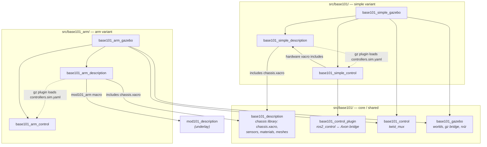

# base101

<p align="center">
  
</p>

An open-source 4WD mobile robot platform designed to carry the mod101 arm and other payloads. Built from 60×20 aluminum extrusion, PLA-CF printed parts, and Waveshare DDSM hub motors.

## At a Glance

| | base101 |
|---|---|
| Motors | 4× DDSM210 |
| Drive | 4WD skid steer |
| Torque (per motor) | 0.85 N·m stall |
| Load capacity | ~12kg total |
| Suspension | PLA-CF printed |
| Footprint | 280 × 400mm |
| Lidar | RPLidar C1 |
| Depth camera | RealSense D435 |
| BOM | ~$340 |


## Chassis

**Frame:** 60×20 aluminum extrusion, black anodized. Two parallel rails connected at the corners by PLA-CF printed mounts. The thin profile keeps the center of gravity low — this is a MacBook Air, not a brick.

**Top plate:** 280×400mm aluminum, 3mm thick, CNC-machined grid of M3 tapped holes on 20mm spacing. Mount anything anywhere — the arm, the lidar, the compute, accessories. No adapters, no T-nuts, just bolt it down.

**Bumpers:** TPU printed corner pieces. Absorb collisions, protect furniture, and visually soften the rectangular chassis. Press-fit onto the extrusion corners, no fasteners needed.


## Drivetrain

**4WD skid steer.** Four hub motors, all driven. Turn-in-place capability. No mecanum wheels, no omni wheels — just rubber tires on smooth direct-drive motors. Quiet, clean, simple kinematics.


### DDSM210

- 0.25 N·m rated / 0.85 N·m stall
- ~65mm diameter, 216g
- UART bus, 9-28V
- ~$25 each

Sized for a 5-8kg robot. Four wheels provide 97 N total tractive force at stall — enough to move 8kg up a 10% incline.


## Sensors

### RPLidar C1

Mounted on the top plate. 360° DTOF scanning, 12m range, 5000 samples/sec. Handles SLAM, mapping, and obstacle detection. ROS2 driver available out of the box.

### Intel RealSense D435

Front-mounted between the extrusion rails. 87° wide FOV for spatial awareness and 3D perception. Provides point cloud data for obstacle avoidance and workspace mapping. The wide field of view captures the arm's entire workspace in front of the robot.


## Software

ROS 2 Jazzy workspace. The `diff_drive_controller` handles skid-steer kinematics for the DDSM210 drivetrain.

### Packages

The workspace is a **shared core** plus one self-contained stack per
**variant** (`description` / `gazebo` / `control`). Variants are grouped into
folders under `src/` (`base101/`, `base101_arm/`); colcon discovers packages
recursively, so the folders are purely organisational. Packages parked out of
the build live in [`attic/`](attic/README.md).

**Core / shared** — `src/base101/`

| Package | Type | Purpose |
|---|---|---|
| `base101_description` | ament_python | **Shared chassis library**: chassis links/joints, sensors, materials, meshes. Every variant `xacro:include`s its `chassis.xacro` — *not launched directly*. |
| `base101_control` | ament_cmake | Control-common: `twist_mux` config. |
| `base101_control_plugin` | ament_cmake | `ros2_control` SystemInterface bridging wheel/arm/camera command+state interfaces to the Axon firmware's `/motor_manager/*` topics (zenoh). Shared by all variants. |
| `base101_gazebo` | ament_cmake | Sim-common: Gazebo worlds, ros↔gz bridge, RViz preset. |

**Variant stacks** — each is a self-contained `description` + `gazebo` + `control` trio that includes the shared chassis and adds only its own hardware. You launch a variant package — never `base101_description`.

| Variant | Folder | Adds to the chassis | Packages |
|---|---|---|---|
| **simple** | `src/base101/` | nothing (the bare base robot) | `base101_simple_{description,gazebo,control}` |
| **arm** | `src/base101_arm/` | 1 mod101 arm on the chassis deck | `base101_arm_{description,gazebo,control,moveit_config}` |
| ~~tower~~ | `attic/base101_tower/` | *parked* — lift column + pan/tilt head + 2 bracket arms | not built ([why](attic/README.md)) |

The simple variant's `*_control` also carries the real-hardware bringup (`control_stack.launch.py`, the Axon hardware xacro) — see [`HARDWARE.md`](HARDWARE.md).

**Other tooling** — `src/`

| Package | Type | Purpose |
|---|---|---|
| `robocore_agent` | ament_python | Robocore (blueprint engine) agent: ROS interface, task/safety model, Nav2 + SLAM managers, sensor streams. |
| `base101_mcp` | ament_python | Generic ROS2 ↔ MCP (Model Context Protocol) bridge. Lets Claude (or any MCP client) discover topics/services and read/publish messages over natural language. Requires `pip install "fastmcp>=2,<3"`. |
| `base101_teleop` | ament_python | Standalone single-page web teleop (base + every joint) on `:8700`. Fallback for the rosboard Joint sliders card. |
| `rosboard` | ament_python | Vendored web dashboard. Carries two publisher cards: **Teleop** (Twist) and **Joint sliders** (Float64MultiArray position commands for tower + arms). |

### Package structure



Solid arrows are build/`xacro:include` dependencies; dashed arrows are the
runtime `gz_ros2_control` controller-file lookup (resolved at Gazebo spawn,
carried as a manifest dep by the `*_gazebo` package to avoid a cycle).

Manual test procedures for every variant, tool and launch combination are in
[`docs/testing.md`](docs/testing.md).

### Quickstart

```bash
colcon build --symlink-install
source install/setup.bash
ros2 launch base101_simple_gazebo gazebo.launch.py                    # bare chassis, sticky_floor world
ros2 launch base101_arm_gazebo    gazebo.launch.py arm:=true          # chassis + 1 mod101 arm
ros2 launch base101_simple_gazebo gazebo.launch.py world:=empty.sdf   # pick a world
ros2 launch base101_simple_gazebo gazebo.launch.py camera:=oak_d      # Luxonis OAK-D instead of the D435
ros2 launch base101_simple_description display.launch.py              # rviz only, no sim
```

Web teleop is at `http://localhost:8888/` (rosboard) once the sim is up.
(The arm variant needs the [mod101](https://github.com/robocore-dev/mod101)
underlay built and sourced first.)

`camera:=realsense|oak_d` picks which depth module hangs off the front bracket
(default `realsense`). It swaps the mesh and the simulated FOV only — the
topics stay `/base_camera/*` and the frames stay `camera_link` /
`camera_optical_frame` either way. Both `gazebo.launch.py` and
`display.launch.py` take it.

For the **real robot** (Axon 2 firmware over zenoh), see [`HARDWARE.md`](HARDWARE.md):

```bash
export RMW_IMPLEMENTATION=rmw_zenoh_cpp
ros2 launch base101_simple_control control_stack.launch.py
```

### Cross tower (parked)

The vertical tower — column with a prismatic **lift**, crossbeam with two
arm-mount brackets, **pan/tilt head** with a camera — is **parked in
[`attic/base101_tower/`](attic/README.md)** and is not built. It bolted onto
`top_plate_1`, and the 2026-08 chassis re-export shrank that deck from
340 × 240 mm to 180 × 240 mm and raised it 48 mm onto standoffs, so its mount
origin no longer lands anywhere real. The lift was rough to begin with.

To revive it: `git mv attic/base101_tower src/base101_tower`, then re-derive
`tower_mount_xyz` in `urdf/tower.xacro` against the new deck. Background:
[`docs/worklogs/tower.md`](docs/worklogs/tower.md).

### mod101 arm

The [mod101](https://github.com/robocore-dev/mod101) repo stays standalone —
its arm is a prefix-parameterised xacro macro (`mod101_arm`, see
`mod101_description/urdf/mod101_macro.xacro`). The **arm** variant
(`base101_arm_description`) instantiates it once, deck-mounted, producing
joints `arm_1…6`. (The parked tower instantiated it twice on the crossbeam
brackets, as `left_arm_1…6` / `right_arm_1…6`.)

**Build** (mod101 first, then this workspace as an overlay — only needed
when you actually use `arm:=true`):

```bash
cd ~/Work/mod101  && colcon build --symlink-install && source install/setup.bash
cd ~/Work/base101
colcon build --symlink-install --cmake-args -DPython3_EXECUTABLE=/usr/bin/python3
source install/setup.bash
```

(The `Python3_EXECUTABLE` pin guards against a stray non-system python on
`PATH` breaking ament's package.xml parsing and `rosidl`'s `em` import — see
the project-level `~/.colcon/defaults.yaml` note in [`HARDWARE.md`](HARDWARE.md).
The `mod101_description` exec_depend in `base101_arm_description` is not a
rosdep key — pass `--skip-keys mod101_description` to `rosdep install` if you
use it.)

**Launch:**

```bash
ros2 launch base101_arm_gazebo gazebo.launch.py arm:=true                   # jaws gripper
ros2 launch base101_arm_gazebo gazebo.launch.py arm:=true arm_tool:=parallel
ros2 launch base101_arm_description display.launch.py arm:=true            # rviz only
```

`arm_tool` defaults to whatever the mod101 configurator last saved, as do the
rail lengths and servo mounts — `mod101_config.xacro` is the single source of
truth and base101 reads it, so reconfiguring the arm and rebuilding is enough.

**Motion planning** (`base101_arm_moveit_config`):

```bash
ros2 launch base101_arm_moveit_config demo.launch.py     # gazebo + move_group
```

This exists because mod101's own MoveIt config only knows arm-vs-arm
collisions; the arm can reach every part of the chassis it sits on, so the
composed robot needs its own self-collision matrix. The planning scene knows
the robot but not the world — see
[`docs/obstacle-awareness.md`](docs/obstacle-awareness.md) for where perceived
obstacles should live relative to a picking layer. Note the sim must run with
`arm_control:=moveit` (the demo launch does this) to spawn the
`FollowJointTrajectory` controllers instead of the `Float64MultiArray` ones the
web sliders use — see
[`base101_arm_moveit_config/README.md`](src/base101_arm/base101_arm_moveit_config/README.md).

**Controllers** (arm/gripper are `position_controllers/JointGroupPositionController`,
commands are `std_msgs/Float64MultiArray` on `/<name>/commands`):

| Controller | Joints |
|---|---|
| `arm_controller` | `arm_joint_base, arm_joint_shoulder, arm_joint_elbow, arm_joint_wrist_tilt, arm_joint_wrist_roll` |
| `gripper_controller` | `arm_6` (the tool joint) |
| `diff_drive_controller` | wheels (via `twist_mux`) |

The wrist camera is bridged as `/arm_wrist_camera/image_raw`. Integration
notes (mount-point measurement, the arm-yaw fix, the
stale-`robot_state_publisher` gotcha):
[`docs/worklogs/dual_arm.md`](docs/worklogs/dual_arm.md).

### Teleop

Two ways to drive everything from a browser:

- **rosboard "Joint sliders" card** (recommended): open rosboard
  (`http://localhost:8888/`), pick **Joint sliders** in the System nav. One
  panel with a position slider for every controlled joint — lift, pan/tilt
  head, both arms, both grippers — initialised from the live robot pose,
  with live position readouts and a re-sync button. Groups whose hardware
  isn't loaded hide automatically; the card persists across reloads. Base
  driving stays on the separate **Teleop** card. (Backed by rosboard's
  `MSG_PUB` channel; `std_msgs/Float64MultiArray` is allowlisted and —
  unlike Twist — deliberately *not* zeroed by the publish watchdog, so
  position commands hold when the browser goes quiet.)
- **`base101_teleop`** — a zero-dependency standalone fallback:
  `ros2 run base101_teleop server` → `http://localhost:8700/`. Same sliders
  plus a hold-to-drive base pad. See
  [`src/base101_teleop/README.md`](src/base101_teleop/README.md).

### Simulation

The robot runs in **Gazebo Sim** via `gz_ros2_control`. A `simulator` xacro
arg on each variant (`gazebo` | `none`) selects whether the URDF carries the
sim ros2_control + extension tags; `none` is the bare URDF for rviz / real
hardware. Launch a variant's `*_gazebo` package (see Quickstart). The sim
publishes the standard `/cmd_vel_*`, `/odom`, `/scan`, `/joint_states`, and
`/base_camera/image_raw` topics. Worlds and the gz↔ros bridge config live in
the shared `base101_gazebo` package.


## Project Status

- [x] Chassis design (Fusion 360)
- [x] Render and proportioning
- [x] Motor selection and analysis
- [x] Suspension design (PLA-CF adaptation)
- [x] URDF/xacro
- [x] Gazebo simulation
- [x] ros2_control integration
- [x] Cross tower (prismatic lift + pan/tilt head) — **tower** variant
- [x] Single deck-mounted mod101 arm — **arm** variant
- [x] Combined base101 + dual mod101 system (tower variant, `arms:=true`)
- [x] Per-variant package split (simple / arm / tower stacks over a shared chassis)
- [x] Web teleop for all joints (rosboard Joint sliders + `base101_teleop`)
- [ ] E-stop handle mechanism
- [ ] CNC top plate manufacturing files (DXF)

## Related Projects

- **[mod101](https://github.com/robocore-dev/mod101)** — 5+1 DOF modular robot arm
- **[Axon](https://github.com/robocore-dev/axon)** — Multi-protocol controller board
- **[Forge](https://github.com/robocore-dev/forge)** — ROS2 deployment orchestration

## License

MIT
